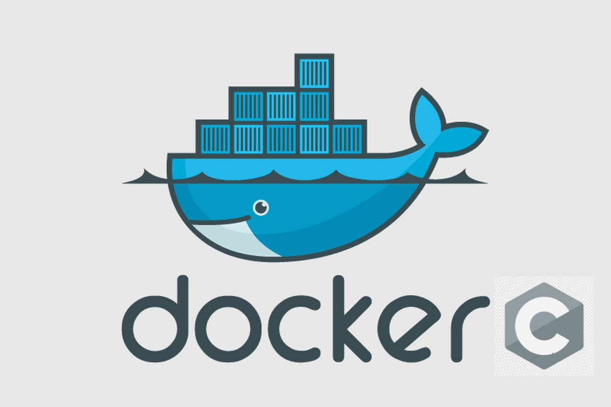

<p align="center">
  
</p>

# Distribuindo uma aplicação com o Dockerfile

## Introdução
Distribuir aplicações nem sempre é uma trabalho tranquilo, ainda mais quando se é possível ter uma infinidades de opções, desde sistemas operacionais e versões de bibliotecas. Isso requer cada vez mais a preocupação de desenvolver aplicações que ofereçam portabilidade, dependendo das circunstâncias nem sempre é possível alcançá-la. O problema persiste se a aplicação foi desenvolvida em alguma distro Linux, mas existe a necessidade de se executar em um Windows, isso pode acontecer. Agora com o WSL é possível rodar aplicações Linux com maior facilidade e assim,  facilitando a distribuição das aplicações em forma de containers. Nesse artigo será abordado como é feito uma distribuição de uma aplicação conteinerizada.

## O que são containers?
Containers são ambientes onde é possível isolar a aplicação com as suas dependências, o tornando fácil de se implantar. Para se obter esse isolamento será usado o Docker que é uma ferramenta que permite o gerênciamento desse containers.

## Onde aprender sobre Docker?
Existem diversas formas de aprender Docker. Existe uma que é bem interessante e interativa, funcionando no formato de um laboratório, onde se é possível testar os comandos usando um ambiente web. Essa plataforma é conhecida como Play with Docker. O link pode ser acessado [aqui](https://www.docker.com/play-with-docker/).

## Como distribuir usando Docker?
Há diversas formas de se distribuir uma aplicação usando Docker. Uma forma seria gerar uma imagem com a aplicação e todas suas dependências, e comitar a imagem resultante no dockerhub, mediante login. O usuário interessado usa o dockerhub para baixar a imagem e executar. Outra forma seria com a imagem resultante, exportar a imagem em um arquivo comprimido, e enviar esse arquivo para os interessados. Uma forma que é bem leve e consome menos recursos é através do Dockerfile.

## O que é Dockerfile?
Dockerfile é um script que descreve como a imagem vai ser construída, informando qual a distribuição base que vai ser utilizada, quais arquivos vão ser copiados para a imagem. Informa onde vai ser o diretório base, e quais dependências vão ser instaladas, a porta vai expor caso a aplicação tenha conectividade, entre outras coisas.

## Instalando o Docker
Para instalar o Docker basta seguir o esse [link](https://docs.docker.com/engine/install/). Aqui é possível escolher o sistema operacional de preferência para realizar a instalação.

## Como montar um Dockerfile?
Para montar um Dockerfile é importante conhecer todas as instruções que estão disponíveis. Para mais informações sobre quais diretivas estão disponíveis, acesse o [link](https://docs.docker.com/engine/reference/builder/). Para fins de simplicação algumas dessas diretivas vão ser utilizadas.

* FROM especifica qual vai ser a imagem base 
* RUN executa um comando durante o processo de construção da imagem, é aqui que será instaladas as dependências
* WORKSPACE define o diretório base 
* COPY permite a cópia de arquivos do host para a imagem
* EXPOSE expõe uma porta para a aplicação poder se comunicar, podendo ser UDP ou TCP
* ENTRYPOINT inicia o container com o comando espeficicado

## Preparando a aplicação
A aplicação é um servidor simples em UDP, que responde qualquer requisição enviando um texto. Para preparar a aplicação, a estrutura de pastas inicial é organizada da seguinte forma:

```bash
docker
├── CMakelists.txt
├── Dockerfile
└── src
    └── main.c
```

O comando a seguir irá construir toda essa estrutura:
```bash
$ cd && mkdir -p docker/src && touch docker/CMakeLists.txt docker/src/main.c docker/Dockerfile
```

Para facilitar o desenvolvimento da aplicação, será utilizado uma biblioteca chamada de communication. Para adicionar essa biblioteca no projeto é importante ter iniciado um repositorio git. Para iniciar o git acesse a pasta docker criada e execute o comando git init.

```bash
$ cd docker 
$ git init
```

Para adicionar a biblioteca communication ao projeto, será utilizado o git submodule, assim é possível trazer outros módulos para o projeto. 

```bash
$ git submodule add https://github.com/NakedSolidSnake/communication.git
```
É possível notar que a pasta communication é adicionada ao projeto. Verificando novamente a estrutura de pastas, o resultado deverá estar assim:

```bash
docker
├── CMakeLists.txt
├── communication
│   ├── CMakeLists.txt
│   ├── include
│   │   └── udp
│   │       └── udp.h
│   ├── src
│   │   └── udp
│   │       ├── client
│   │       │   ├── udp_client.c
│   │       │   └── udp_client.h
│   │       ├── server
│   │       │   ├── udp_server.c
│   │       │   └── udp_server.h
│   │       └── udp.c
│   └── tests
│       ├── client_test.c
│       └── server_test.c
├── Dockerfile
└── src
    └── main.c
```

O próximo passo é preencher o CMakeLists.txt.

O primeiro passo é definir a versão mínima do cmake. Nesse caso vai ser a versão 3.16
```bash
cmake_minimum_required(VERSION 3.16)
```

O segundo passo é definir o nome do projeto
```bash
project(Docker)
```

O terceiro passo é configurar as flags de compilação. O define _GNU_SOURCE é habilitado, warnings, e a versão do compilador é configurada para C99.

```bash
set (CMAKE_C_FLAGS "-D_GNU_SOURCE -Wall -std=c99")
```

O quarto passo é configurar o destino dos artefatos. Nesse caso se for um executável vai para a pasta bin, e se for uma biblioteca vai para a pasta lib

```bash
set (CMAKE_RUNTIME_OUTPUT_DIRECTORY ${CMAKE_BINARY_DIR}/bin)
set (LIBRARY_OUTPUT_PATH ${CMAKE_BINARY_DIR}/lib)
```

O quinto passo é definir o perfil de compilação. Isso é possível de ser definido durante a configuração do cmake. Mas será definido para ser sempre debug.

```bash
set (CMAKE_BUILD_TYPE Debug)
```

O sexto passo é adicionar o componente communication ao projeto. O projeto communication já possui seu próprio CMakelists.txt, que tem todas as instruções para gerar a biblioteca. Para que seja executada apartir do CMakeLists.txt principal basta adicionar a pasta do projeto communication e o CMakeLists.txt será executado.

```bash
add_subdirectory (communication)
```

O último passo é gerar o binário da aplicação. Aqui é especificado quais a bibliotecas serão linkadas, e quais arquivos que compoẽm o artefato final.

```bash
add_executable(server "")
target_link_libraries(server communication)
target_sources(server 
    PUBLIC 
    ${CMAKE_CURRENT_LIST_DIR}/src/main.c
    )
```

Com o CMakeLists.txt concluído, agora é necessário preencher o main.c com o conteúdo do sample para servidor da biblioteca communication e mudar a porta para 8089. Já é um ponto onde é possível compilar e gerar o artefato. Esse artefato será usado para a distribuição da imagem.

O artefato pode ser gerado executando o seguintes comandos:

```bash
$ mkdir build && cd build
$ cmake ..
$ make
```

Ao término do build, o artefato está disponível no diretório bin como o nome de server. Nesse ponto, a imagem será descrita no arquivo Dockerfile.

A primeira diretiva é definir qual vai ser a imagem base. Para esse caso será utilizada o ubuntu

```bash
FROM ubuntu
```

A Segunda diretiva é a definição de qual diretório vai ser o workspace da aplicação. Nada mais original do que chamar de /app

```bash
WORKDIR /app
```

A terceira diretiva é realizar a cópia do artefato compilado na máquina host para a imagem

```bash
COPY build/bin/server server
```

A quarta diretiva é expor a porta do serviço. O servidor usa o protocolo UDP, para esse caso é importante especificar.

```bash
EXPOSE 8089/udp
```
A última diretiva é definir qual aplicação será executada quando a imagem for instanciada, que nesse caso é o server.

```bash
ENTRYPOINT [ "./server" ]
```
Com o Dockerfile concluído, o próximo passo é construir a imagem. Para construir a imagem o comando é:
```bash
$ cd ..
$ docker build -t udp_server .
```

Após o término da construção da imagem, é possível executar usando o comando:

```bash
$ docker container run -d --rm --name udp -p 8089:8089/udp udp_server
```

Para verificar se o container está em execução é utilizado o comando:
```bash
$ docker container ls
```

Para interagir com o container em execução, com o auxílio da ferramenta netcat é possível enviar mensagens para o servidor.

```bash
$ nc -u localhost 8089
```

E o servidor responderá com a mensagem "Server says hello from Docker".

## Conclusão
Com o Dockerfile é possível distribuir a aplicação de uma forma simples. O usuário precisará ter as ferramentas como git para fazer o pull do projeto e docker para a execução do container. Com a imagem gerada, fica fácil distribuir através do dockerhub, mas para o caso de desenvolvedores é uma boa opção por não precisar fazer downloads demorados.
A aplicação estará pronta para ser testado em alguns comandos, sem dor de cabeça.

## Descrição completa do main.c
```bash 
#include <udp.h>
#include <string.h>
#include <stdio.h>

#define BUFFER_SIZE 1024

void on_receive (char *buffer, size_t *size, void *data)
{
    printf ("%s", buffer);
}

void on_send (char *buffer, size_t *size, void *data)
{
    char *message = "Server says hello from Docker";
    strncpy (buffer, message, strlen (message));
    *size = strlen (message);
}

int main (int argc, char *argv[])
{
    udp_t server;
    char buffer [BUFFER_SIZE] = {0};

    udp_args_t args = 
    {
        .type = udp_type_server,
        .port = "8089",
        .buffer = buffer,
        .size = BUFFER_SIZE,
        .on_receive = on_receive,
        .on_send = on_send,        
    };

    udp_init (&server);
    udp_open (&server, &args);
    udp_run (&server);
    udp_close (&server);

    return 0;
}
```

## Descrição completa do CMakeLists.txt

```bash
cmake_minimum_required(VERSION 3.16)
project(Docker)

set (CMAKE_C_FLAGS "-D_GNU_SOURCE -Wall -std=c99")
set (CMAKE_RUNTIME_OUTPUT_DIRECTORY ${CMAKE_BINARY_DIR}/bin)
set (LIBRARY_OUTPUT_PATH ${CMAKE_BINARY_DIR}/lib)
set (CMAKE_BUILD_TYPE Debug)

add_subdirectory (communication)

add_executable(server "")
target_link_libraries(server communication)
target_sources(server 
    PUBLIC 
    ${CMAKE_CURRENT_LIST_DIR}/src/main.c
    )
```
## Descrição completa do Dockerfile
```bash
FROM ubuntu

WORKDIR /app

COPY build/bin/server server

EXPOSE 8089/udp

ENTRYPOINT [ "./server" ]
```
## Referências
[play with docker](https://www.docker.com/play-with-docker/)

[dockefile reference](https://docs.docker.com/engine/reference/builder/)

[video no youtube](https://www.youtube.com/watch?v=y08d6BSpmVk&list=PLH17SJq4cIjDTbSIiXc-ZxTVLmlEmt0zF&index=10)


